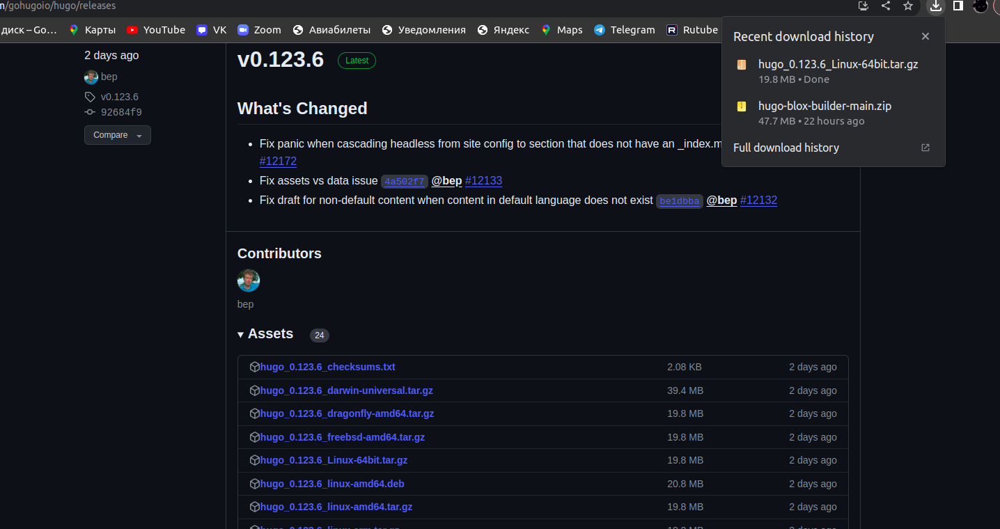
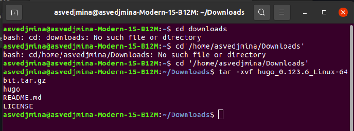
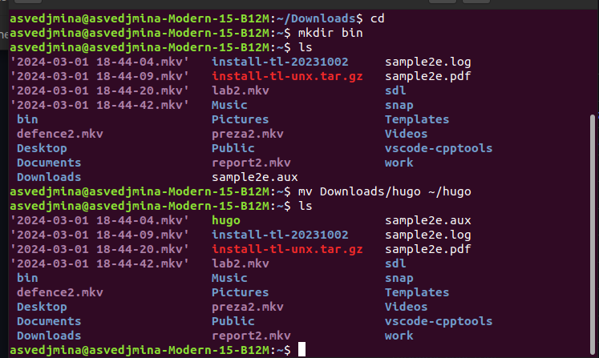
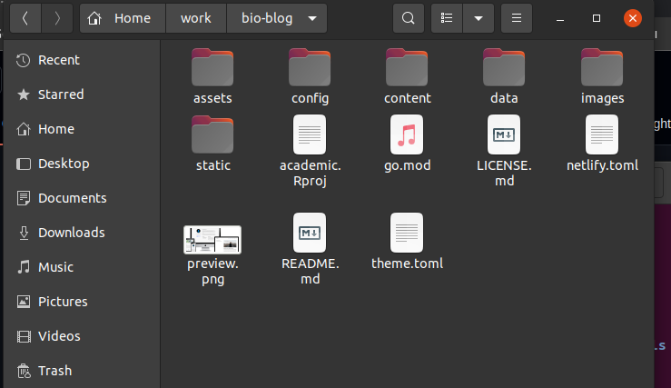
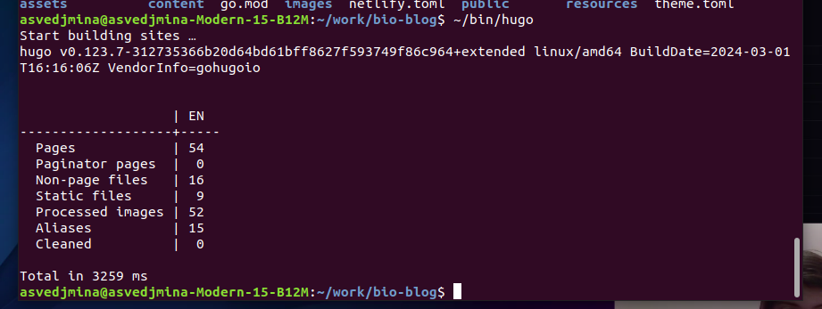
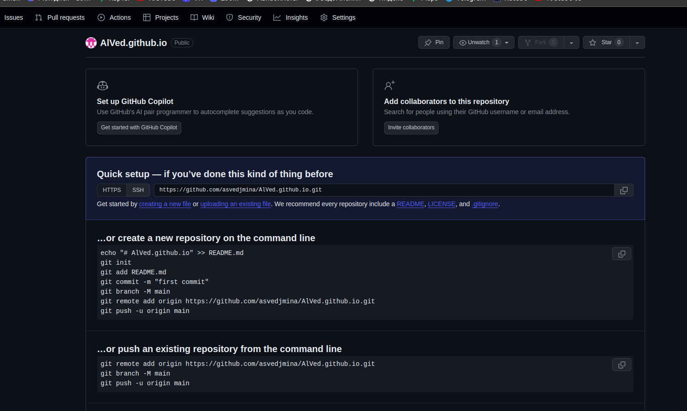
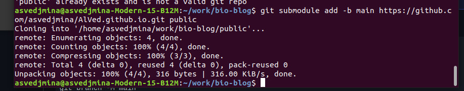
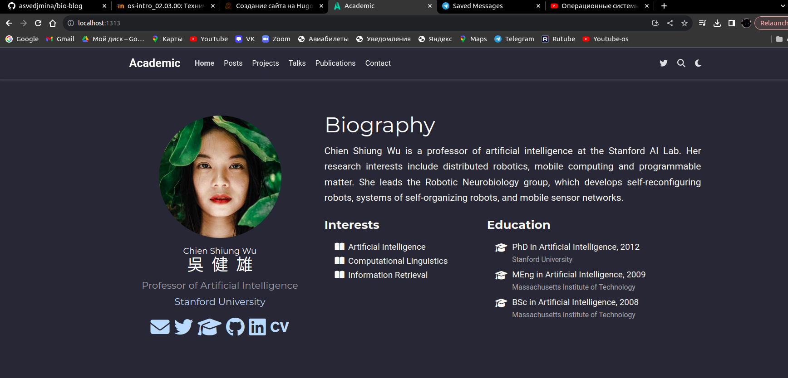

---
## Front matter
lang: ru-RU
title: Индивидуальный проект
subtitle: Этап 1
author:
  - Ведьмина А.С.
institute:
  - Российский университет дружбы народов, Москва, Россия

## i18n babel
babel-lang: russian
babel-otherlangs: english

## Formatting pdf
toc: false
toc-title: Содержание
slide_level: 2
aspectratio: 169
section-titles: true
theme: metropolis
header-includes:
 - \metroset{progressbar=frametitle,sectionpage=progressbar,numbering=fraction}
 - '\makeatletter'
 - '\beamer@ignorenonframefalse'
 - '\makeatother'
---

# Информация

## Докладчик

:::::::::::::: {.columns align=center}
::: {.column width="70%"}

  * Ведьмина Александра Сергеевна
  * студент
  * Российский университет дружбы народов
  * [kulyabov-ds@rudn.ru](mailto:kulyabov-ds@rudn.ru)
  * <https://AlVed.github.io/ru/>

:::
::: {.column width="30%"}

:::
::::::::::::::

# Вводная часть

## Цели и задачи

1. Установить необходимое программное обеспечение hugo.
2. Скачать шаблон темы сайта.
3. Разместить его на хостинге git.
4. Установить параметр для URLs сайта.
5. Разместить заготовку сайта на Github pages.

# Выполнение лабораторной работы

## Установка программного обеспечения

Загружаю последнюю версию hugo и рспаковываю архив.

{#fig:001 width=100%}

## Установка программного обеспечения

{#fig:002 width=100%}

## Установка программного обеспечения

Перемещаю hugo в новый каталог.

{#fig:003 width=100%}

## Установка темы сайта

Создаю каталог bio-blog в директории work, куда помещаю файлы из темы academic-theme-cv.

{#fig:004 width=100%}

## Создание сайта

Создаю сайт.

{#fig:005 width=100%}

## Создание ...github.io

Создаю особый репозиторий на гитхабе в формате ...github.io.

{#fig:006 width=100%}

## Создание ...github.io

Привязываю AlVed.github.io к своему проекту.

{#fig:007 width=100%}

## Запуск сайта

Проверяю, всё ли получилось, открываю сайт.

{#fig:008 width=100%}

# Результаты

В ходе первого этапа индивидуального проекта я разместила на Github pages заготовки для персонального сайта.

