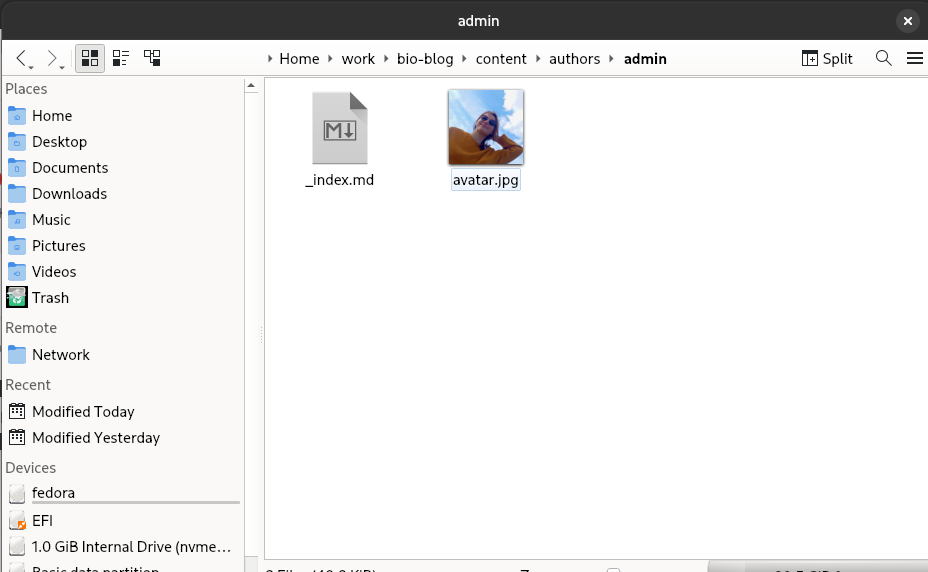
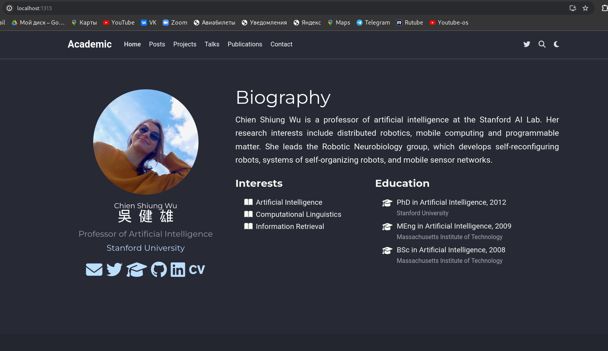
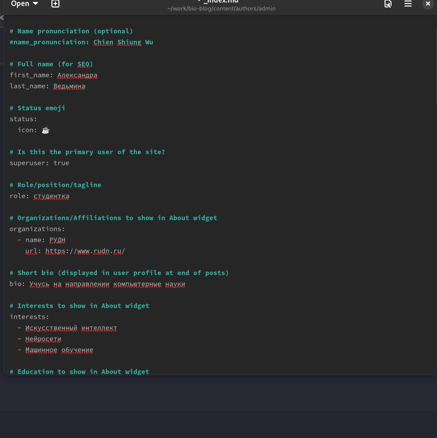
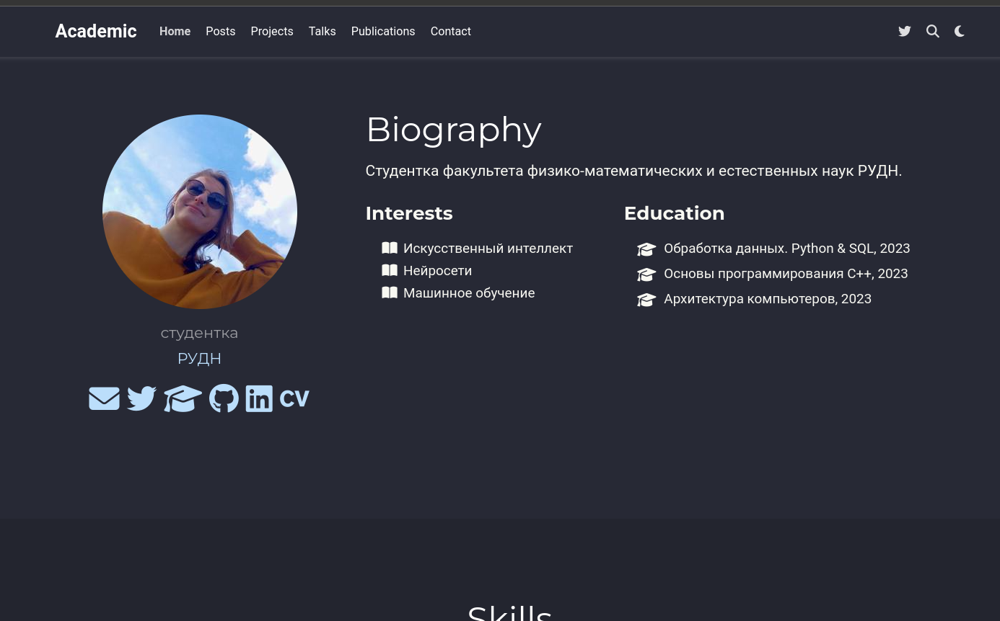
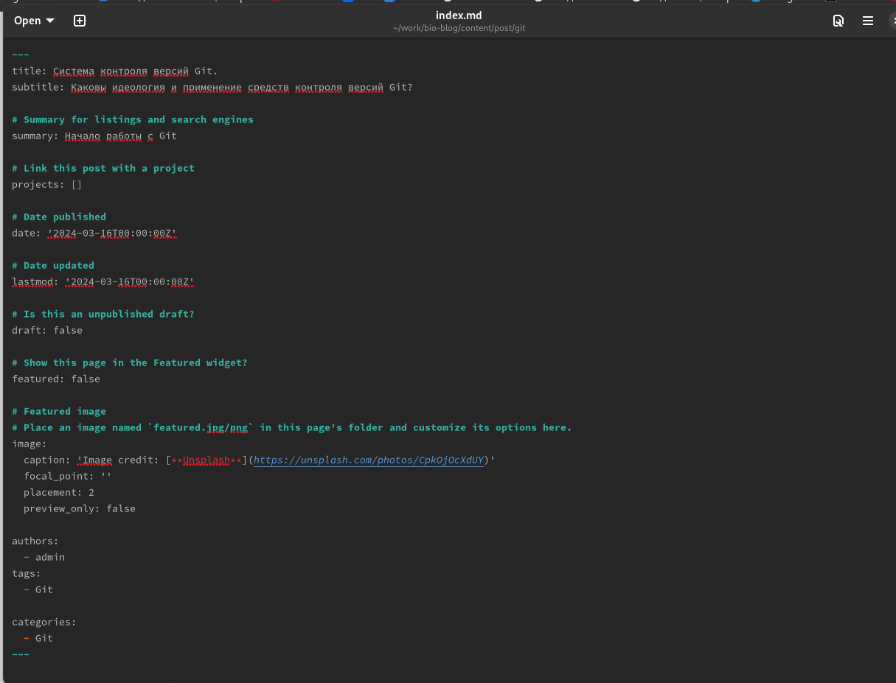
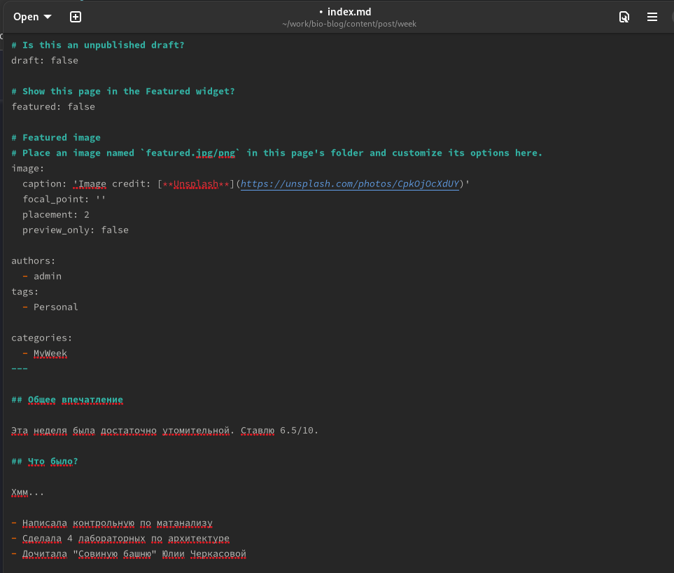
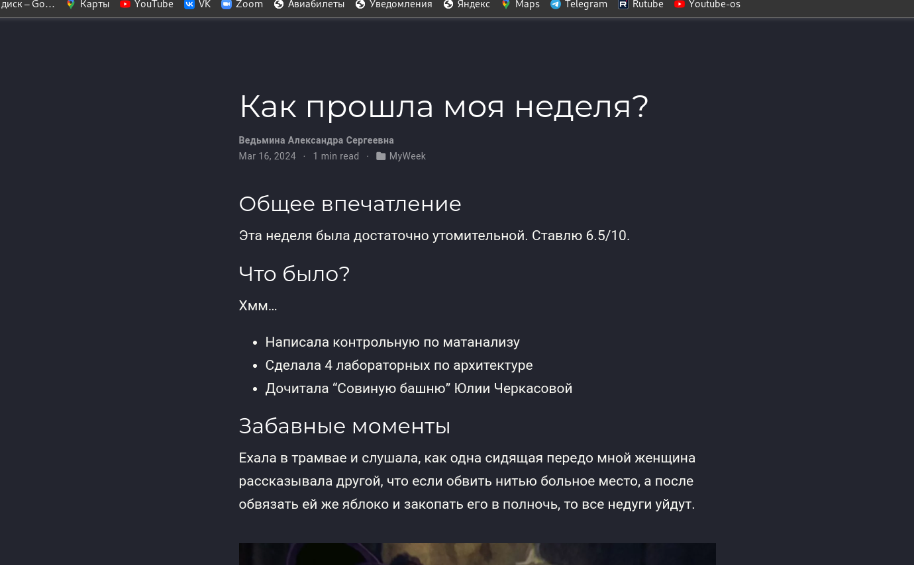

---
## Front matter
lang: ru-RU
title: Индивидуальный проект 
subtitle: 2 этап
author:
  - Ведьмина А.С.
institute:
  - Российский университет дружбы народов, Москва, Россия

## i18n babel
babel-lang: russian
babel-otherlangs: english

## Formatting pdf
toc: false
toc-title: Содержание
slide_level: 2
aspectratio: 169
section-titles: true
theme: metropolis
header-includes:
 - \metroset{progressbar=frametitle,sectionpage=progressbar,numbering=fraction}
 - '\makeatletter'
 - '\beamer@ignorenonframefalse'
 - '\makeatother'
---

# Информация

## Докладчик

:::::::::::::: {.columns align=center}
::: {.column width="70%"}

  * Ведьмина Александра Сергеевна
  * студентка
  * ФФМиЕН
  * Российский университет дружбы народов
  * <https://asvedjmina.github.io/ru/>

:::
::: {.column width="30%"}

:::
::::::::::::::

# Цель работы

- Заполнить личную информацию на сайте
- Сделать пост о прошедшей неделе
- Сделать пост о системе контроля версий Git

# Выполнение работы

## Заполнение данных

Загружаю свою фотографию.

{#fig:001 width=100%}

## Заполнение данных

Смотрю, что получилось.

{#fig:002 width=100%}

## Заполнение данных

Заполняю личные данные об образовании, интересах, хобби и тд

{#fig:003 width=100%}

## Заполнение данных

Запускаю сайт.
{#fig:004 width=100%}

## Заполнение данных

Делаю пост о системе контроля версий Git.

{#fig:005 width=100%}

## Заполнение данных

Делаю пост о прошедшей неделе.

{#fig:006 width=100%}

## Заполнение данных

Смотрю, что получилось.

{#fig:007 width=100%}

# Выводы

Все поставленные задачи выполнены.
