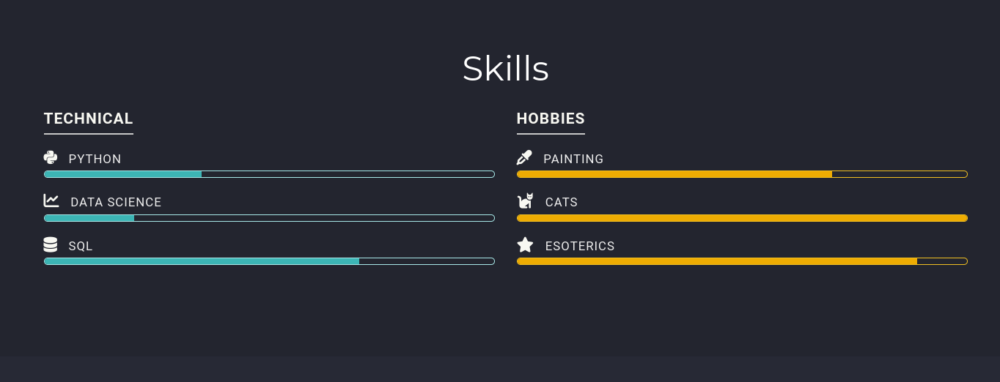
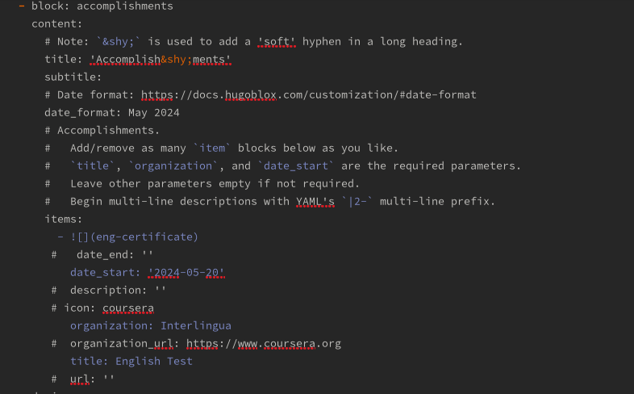
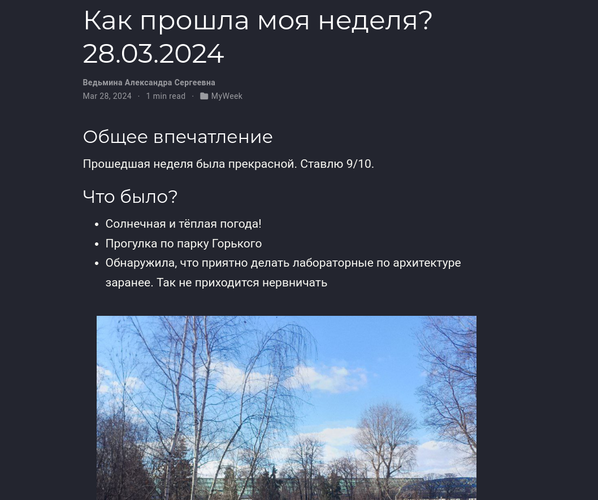
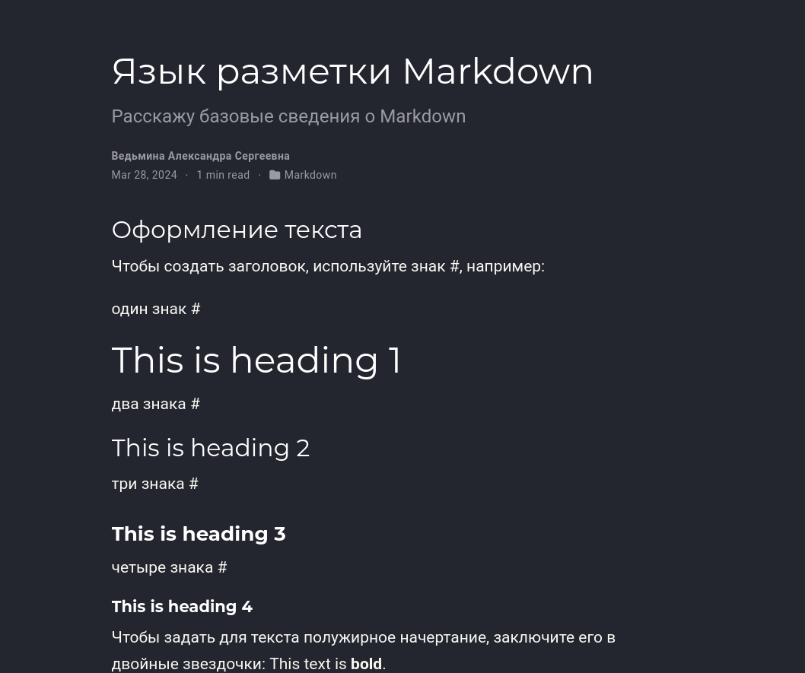

---
## Front matter
lang: ru-RU
title: Индивидуальный проект
subtitle: Этап №3
author:
  - Ведьмина А.С.
institute:
  - Российский университет дружбы народов, Москва, Россия
  
## i18n babel
babel-lang: russian
babel-otherlangs: english

## Formatting pdf
toc: false
toc-title: Содержание
slide_level: 2
aspectratio: 169
section-titles: true
theme: metropolis
header-includes:
 - \metroset{progressbar=frametitle,sectionpage=progressbar,numbering=fraction}
 - '\makeatletter'
 - '\beamer@ignorenonframefalse'
 - '\makeatother'
---

# Информация

## Докладчик

:::::::::::::: {.columns align=center}
::: {.column width="70%"}

  * Ведьмина Александра Сергеевна
  * студентка
  * ФФМиЕН
  * Российский университет дружбы народов
  * [1132236003@rudn.ru](mailto:1132236003@rudn.ru)
  * <https://vedjmina.github.io/ru/>

:::
::: {.column width="30%"}

:::
::::::::::::::

# Цель работы

Добавить к сайту достижения.

# Задание

1. Добавить достижения.
2. Сделать пост о прошедшей неделе.
3. Добавить пост на тему пот выбору.

# Выполнение лабораторной работы

## Выполнение лабораторной работы

Добавляю информацию о навыках.

## Выполнение лабораторной работы

Добавляю информацию о достижениях. 

## Выполнение лабораторной работы

Создаю пост о прошедшей неделе.

## Выполнение лабораторной работы

Добавляю пост о языке разметки Markdown.

# Выводы

В ходе лабораторной работы все поставленные задачи были выполнены.

