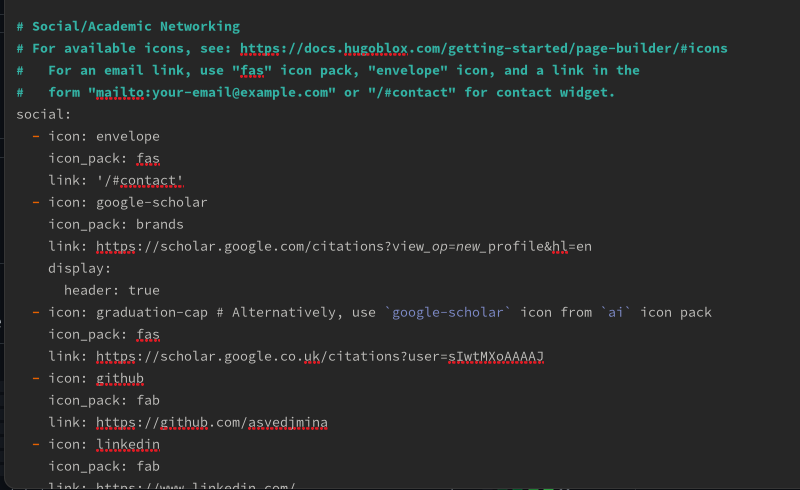

---
## Front matter
lang: ru-RU
title: Индивидуальный проект
subtitle: 4 этап
author:
  - КВедьмина А.С.
institute:
  - Российский университет дружбы народов, Москва, Россия

## i18n babel
babel-lang: russian
babel-otherlangs: english

## Formatting pdf
toc: false
toc-title: Содержание
slide_level: 2
aspectratio: 169
section-titles: true
theme: metropolis
header-includes:
 - \metroset{progressbar=frametitle,sectionpage=progressbar,numbering=fraction}
 - '\makeatletter'
 - '\beamer@ignorenonframefalse'
 - '\makeatother'
---

# Информация

## Докладчик

:::::::::::::: {.columns align=center}
::: {.column width="70%"}

  * Ведьмина Александра Сергеевна
  * студентка
  * ФФМиЕН
  * Российский университет дружбы народов
  * [1132236003@rudn.ru](mailto:1132236003@rudn.ru)
  * <https://asvedjmina.github.io/ru/>

:::
::: {.column width="30%"}

:::
::::::::::::::
# Вводная часть

## Цель работы

Дополнить свой сайт github pages.

## Задание

1. Зарегистрироваться на образовательных ресурсах.
2. Сделать пост о прошедшей неделе.
3. Сделать пост о создании презентаций.

# Выполнение лабораторной работы

## Выполнение лабораторной работы

Регистрируюсь на eLibrary.

## Выполнение лабораторной работы

Регистрируюсь на гугл-сколар.

## Выполнение лабораторной работы

Регистрируюсь на orcid.

## Выполнение лабораторной работы

Регистрируюсь на Mendeley.

## Выполнение лабораторной работы

Регистрируюсь на research-gate.

## Выполнение лабораторной работы

Регистрируюсь на arxiv.

## Выполнение лабораторной работы

Регистрируюсь на academia-edu.

## Выполнение лабораторной работы

Делаю пост о прошедшей неделе.

## Выполнение лабораторной работы

Вношу ссылки на сайт.

# Выводы

Все поставленные задачи выполнены.
